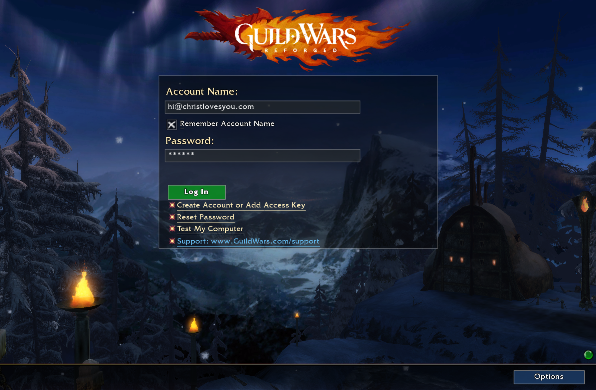
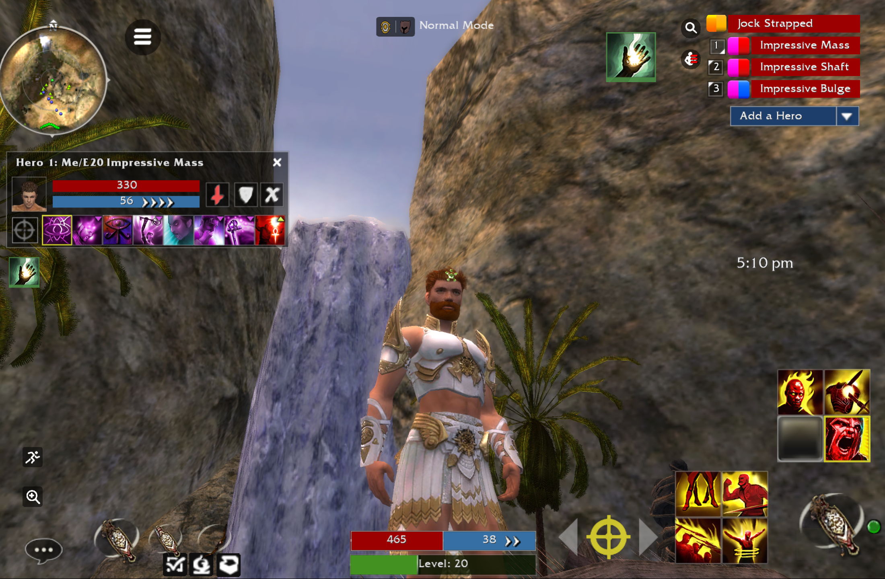
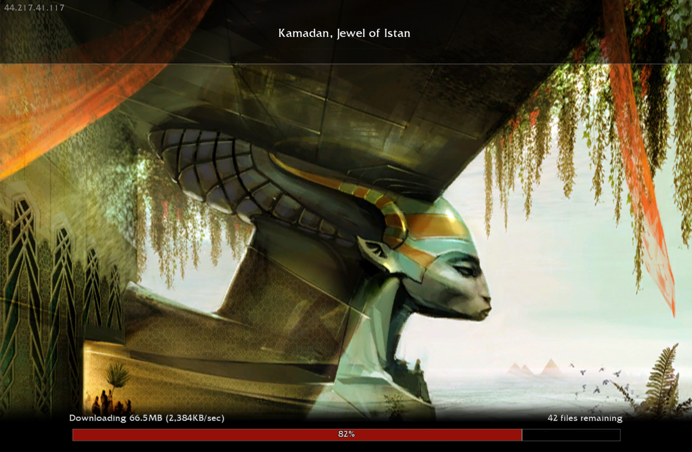

# Minimalus Mobile

Minimalus Mobile is the Android companion build for **Minimalus UI v3.2**, gkoogz / Jujin's slim Guild Wars interface mod. It packages the Guild Wars Reforged mobile web client in an Android WebView and applies the Minimalus texture replacement table at runtime.

The public APK is intended for easy sideloading: download it from the latest GitHub release on an Android device, allow the browser to install unknown apps when Android prompts you, and launch **Minimalus Mobile**.

## Latest APK

Download the current APK from the [latest MinimalusMobile release](https://github.com/gkoogz/MinimalusMobile/releases/latest).

The current public beta is **Minimalus Mobile 1.0.4**. It has reached the live game world on the author's Android tablet with Minimalus injection active, but it has not yet had broad device, OS, reinstall, account, or game-update soak testing.

## Featured Images







## What This Build Does

- Serves the bundled Guild Wars Reforged web client from a stable local origin.
- Proxies required patch and login traffic through the Android app so the WebView can complete the native mobile login flow.
- Patches the downloaded game client script before execution.
- Replaces matching runtime textures with Minimalus UI v3.2 textures.
- Gives mobile-specific texture edits priority over the PC texture set.

The replacement table is generated from the working Minimalus folders:

1. `Altered` and `Unaltered` provide the PC/desktop baseline.
2. `AlteredMobile` and `UnalteredMobile` are applied afterward and override matching entries.

The repo also includes a snapshot of those source texture folders under `assets/` so the shipped APK can be audited and rebuilt from the same DDS inputs.

## Android Compatibility

Minimalus Mobile follows the retail Guild Wars Reforged Android floor: **Android 7.0/API 24 or newer**, with more than **3 GB RAM** recommended by the retail client guidance. The APK is built with `minSdk 24`, `targetSdk 35`, and a WebView-based runtime, so real-world compatibility also depends on the installed Android System WebView/Chrome provider and GPU WebGL support.

Compatibility expectations:

| Android version | Status |
|---|---|
| Android 7.x/API 24-25 | Minimum supported range; use an updated Android System WebView when possible. |
| Android 8-11/API 26-30 | Supported target range for older phones and tablets with adequate RAM/GPU. |
| Android 12/API 31-32 | Supported; retail Guild Wars Reforged recently fixed an Android 12 compatibility issue, so use current game assets. |
| Android 13-15/API 33-35 | Primary modern support range. |

The app logs an Android compatibility profile at startup, including SDK version, RAM, low-memory state, and WebView package on Android 8+. It also requests a larger heap for the WebView/WebGL process and disables unnecessary WebView features such as geolocation, form saving, and zoom controls to keep the runtime thin and predictable.

## Build From Source

Requirements:

- JDK 17 or newer
- Android SDK with compile SDK 35
- Gradle or Android Studio
- Python 3.11+
- Microsoft DirectX SDK `texconv.exe` for regenerating texture replacements from DDS files

Build the checked-in Android project:

```powershell
cd C:\path\to\MinimalusMobile
gradle assembleDebug
```

The APK is written to:

```text
app\build\outputs\apk\debug\app-debug.apk
```

## Regenerate The Texture Table

By default the tool reads the author's local Minimalus pipeline folder when it exists:

```text
C:\Users\Administrator\Documents\Minimalus UI 3.0 Pipeline\working\Minimalus UI 3.0
```

To use another folder, set `MINIMALUS_PIPELINE_DIR` to a directory containing these four subfolders. A checked-in snapshot is available at `assets/`.

- `Altered`
- `Unaltered`
- `AlteredMobile`
- `UnalteredMobile`

Then run:

```powershell
$env:MINIMALUS_PIPELINE_DIR = "C:\path\to\Minimalus UI 3.0"
python tools\build_minimalus_mobile_app.py
gradle assembleDebug
```

The generated replacement manifest is also written under `outputs\`.

## Mobile Texture Probe

The probe is included for future maintenance when ArenaNet changes, renames, or resizes native mobile textures. It is a developer tool, not part of the normal player install flow.

Start the bridge on the PC:

```powershell
python tools\mobile_texture_bridge.py
```

Connect the Android device with USB debugging enabled, then route the app back to the PC:

```powershell
adb reverse tcp:8787 tcp:8787
```

Open the bridge UI on the PC:

```text
http://127.0.0.1:8787
```

The bridge can request capture, reset capture state, page through captured textures, preview the selected texture, and dump selected native mobile textures as DDS files into `UnalteredMobile` by default. Override the dump destination with:

```powershell
$env:MINIMALUS_UNALTERED_DIR = "C:\path\to\UnalteredMobile"
```

Probe caveats:

- It is intentionally experimental.
- Text rendering can produce noisy captures.
- Highlighting and capture state should be reset between runs.
- For ordinary users, use the release APK instead of the probe.

## Stability Status

This APK is installable and functional enough for a public beta, but it should not be described as fully stable yet. A final stable release should be verified against:

- clean install from browser download
- app restart after successful login
- device reboot
- game client update / patch refresh
- at least two Android devices or OS versions
- texture replacement count in logcat
- in-game visual pass through inventory, skills, party, map, chat, and login UI

## Related Projects

- [MinimalusUIMod](https://github.com/gkoogz/MinimalusUIMod)
- [uMod Reforged](https://github.com/gkoogz/uMod-Reforged)
